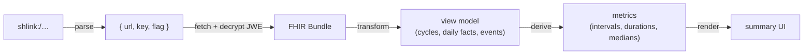

# Viewer reference

A receiver needs to turn a decrypted Bundle into something a clinician (or the patient) can read. The project ships a complete, self-contained reference viewer you can **point at, reuse, or learn from**. It is optional: an app can host its own viewer, embed the transform in another UI, or scan bare SHLinks in a provider workflow.

Reference viewer source: `viewer-src/` in the IG repo.

## The pipeline (what any viewer does)

The reference implementation, file by file (all dependency-light, browser + bun safe):

- `viewer-src/jwe.mjs` — compact JWE `dir`/A256GCM decrypt (+ `zip:DEF` inflate), WebCrypto only.
- `viewer-src/shl.mjs` — parse `shlink:/`, fetch direct-file SHLinks (with base-SHL manifest compatibility for receivers), decrypt → Bundle.
- `viewer-src/transform.mjs` — **the reusable core**: Bundle → application-independent view model `{ meta, cycles[], daily[], byDate, events[], context }`. Tolerant: unknown codes ignored, missing fields skipped, a day with no entry is never treated as "no symptom."
- `viewer-src/viewmodel.mjs` — derive descriptive metrics from the view model (the UI hard-codes no numbers).
- `viewer-src/summary.jsx` — the render layer (React): cycle-comparison strips, per-cycle table, bleeding/pain timeline, symptom heatmap, fertility (BBT) panel, day detail.
- `viewer-src/app.jsx` — glue: read `#shlink:/…` from the URL, paste field, camera scan, or generated `shlink.txt` demo link; prepopulate the chooser; then decrypt, transform, and render after the recipient clicks Open.

## Reuse options

1. **Host the reference viewer.** `scripts/build-viewer.ts` bundles viewer source into self-contained pages plus asset directories (no CDN, no runtime transpile). Local and site builds publish `view.html`, `view2.html`, and `view3.html` side by side. `view.html` is the original reference viewer; `view2.html` is a second launch page for the same implementation; `view3.html` is a bleeding-first alternate built from `view3-src/`.
2. **Embed the core.** Reuse `viewer-src/shl.mjs`, `viewer-src/jwe.mjs`, and `viewer-src/transform.mjs` inside your app while replacing the render layer.

A real `#shlink:/...` fragment prepopulates the chooser and keeps the SHLink key off the server; the recipient enters or accepts the visible name field and clicks Open before the viewer sends the SHLink `recipient` value, decrypts, and renders. A bare visit shows the same explicit chooser (paste a bare `shlink:/...`, scan a QR via the device camera, or load a co-located `shlink.txt` demo link into the paste field) rather than silently rendering demo data as if it were the visitor's own.
3. **Embed the transform.** If your app already has UI, reuse just `transform.mjs` + `viewmodel.mjs` to get the view model and render with your own components.

## Key derivation rules the transform encodes (match these if you write your own)

- **Bleeding day** = a `cycle#menstrual-bleeding` fact with `valueBoolean=true`. Legacy or partial inputs may fall back to flow ≥ spotting, but conformant exports emit the boolean core.
- **No-bleeding day** = a `cycle#menstrual-bleeding` fact with `valueBoolean=false`. Missing means not recorded, not absent.
- **Cycle/episode** = a run of bleeding days; a new episode starts after a gap > 3 bleeding-free days. Interval = onset-to-onset; bleed duration = consecutive bleeding days from onset.
- **Everything derived in the UI** — intervals, medians, heavy-day counts — comes from the granular facts, per the [Specification](specification.html). Nothing is read from precomputed summary fields.

## Privacy

Decrypt and render **client-side only**. Never POST the decrypted FHIR back to a server. For viewer-prefixed links, keep the `shlink:/` in the URL fragment so the key never reaches a server. Dedicated scanner apps can ignore any viewer prefix after extracting the `shlink:/` payload. Display the result as patient-generated data, clearly not clinically attested.

## Verifying a viewer headlessly

The IG repo's `scripts/verify-viewer.ts` serves the built output, drives headless Chromium against both the chooser at `/view` and `/view#shlink:/…`, asserts the fragment URL prepopulates without auto-rendering, and then resolves the SHLink with a recipient name. Adapt it for your own host. (Assert on the *presence* of rendered sections, not the *absence* of an error string — app source text lives in the DOM/bundle and would yield false negatives.)
