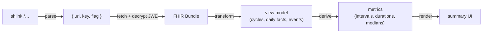

# Viewer reference

A receiver needs to turn a decrypted Bundle into something a clinician (or the patient) can read. The project ships a complete, self-contained reference viewer you can **point at, reuse, or learn from** — you do not have to write one from scratch.

Reference viewer: `https://periodicity.fhir.me/`
Source: `viewer-src/` in the IG repo.

## The pipeline (what any viewer does)

The reference implementation, file by file (all dependency-light, browser + bun safe):

- `viewer-src/jwe.mjs` — compact JWE `dir`/A256GCM decrypt (+ `zip:DEF` inflate), WebCrypto only.
- `viewer-src/shl.mjs` — parse `shlink:/`, fetch direct-file SHLinks (with base-SHL manifest compatibility for receivers), decrypt → Bundle.
- `viewer-src/transform.mjs` — **the reusable core**: Bundle → application-independent view model `{ meta, cycles[], daily[], byDate, events[], context }`. Tolerant: unknown codes ignored, missing fields skipped, a day with no entry is never treated as "no symptom."
- `viewer-src/viewmodel.mjs` — derive descriptive metrics from the view model (the UI hard-codes no numbers).
- `viewer-src/summary.jsx` — the render layer (React): cycle-comparison strips, per-cycle table, bleeding/pain timeline, symptom heatmap, fertility (BBT) panel, day detail.
- `viewer-src/app.jsx` — glue: read `#shlink:/…` from the URL, paste field, camera scan, or generated `shlink.txt` demo link; prepopulate the chooser; then decrypt, transform, and render after the recipient clicks Open.

## Reuse options

1. **Just link to it.** Generate `https://periodicity.fhir.me/#shlink:/…` (or your own copy) and let the user open it. Zero integration.
2. **Host your own copy.** Build it — `scripts/build-viewer.ts` bundles `viewer-src/` into a self-contained `app.js` + `index.html` (no CDN, no runtime transpile) under `input/images/viewer/`. Drop both files on any static host (`periodicity.fhir.me` serves them at the site root; inside the IG output they live at `/viewer/`). A real `#shlink:/…` (or `?shlink=`) prepopulates the chooser and keeps the SHLink visible in the URL; the recipient enters or accepts the visible name field and clicks Open before the viewer sends the SHLink `recipient` value, decrypts, and renders. A bare visit shows the same explicit chooser (paste a link, scan a QR via the device camera, or load a co-located `shlink.txt` demo link into the paste field) rather than silently rendering demo data as if it were the visitor's own.
3. **Embed the transform.** If your app already has UI, reuse just `transform.mjs` + `viewmodel.mjs` to get the view model and render with your own components.

## Key derivation rules the transform encodes (match these if you write your own)

- **Period day** = an explicit menstrual-status-present fact, OR flow ≥ light when no status is given (so flow-only apps still produce cycles), unless the user explicitly said "not menstruating" that day.
- **Intermenstrual bleeding** = a bleeding day (flow ≥ spotting) that is not a period day.
- **Cycle** = a run of period days; a new cycle starts after a gap > 3 bleeding-free days. Cycle length = onset-to-onset; bleed duration = consecutive period days from onset.
- **Everything derived in the UI** — intervals, medians, heavy-day counts — comes from the granular facts, per the IG (`scope.html`). Nothing is read from precomputed summary fields.

## Privacy

Decrypt and render **client-side only**. Never POST the decrypted FHIR back to a server. Keep the `shlink:/` in the URL fragment so the key never reaches a server. Display the result as patient-generated data, clearly not clinically attested.

## Verifying a viewer headlessly

The IG repo's `scripts/verify-viewer.sh` serves the built output, drives headless Chromium against both the chooser at `/viewer/` and `/viewer/#shlink:/…`, asserts the fragment URL prepopulates without auto-rendering, and then resolves the SHLink with a recipient name. Adapt it for your own host. (Assert on the *presence* of rendered sections, not the *absence* of an error string — app source text lives in the DOM/bundle and would yield false negatives.)
